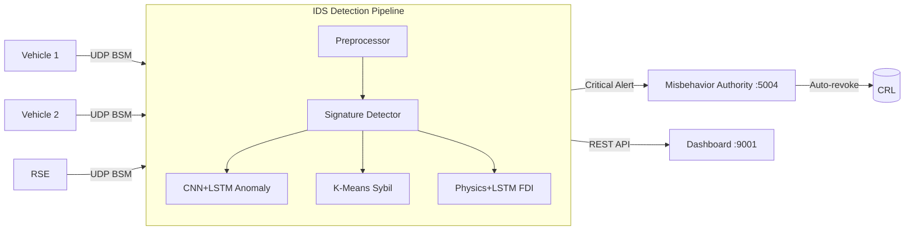

# IDS Implementation — Complete Changelog

> All files created and modified to integrate the **Hybrid AI-Driven Intrusion Detection System** into the V2X PQC-SCMS project.

---

## Summary

| Category | New Files | Modified Files | Total Lines Added |
|----------|-----------|----------------|-------------------|
| IDS Core | 5 | — | ~510 |
| Preprocessing | 2 | — | ~200 |
| Detection Engines | 5 | — | ~680 |
| AI Models | 4 | — | ~540 |
| Metrics & Data | 5 | — | ~640 |
| Integration | — | 4 | ~140 |
| Tests & Training | 2 | — | ~470 |
| **Total** | **23 new files** | **4 modified files** | **~3,180 lines** |

---

## Part 1 — NEW Files (23 files)

---

### 1.1 `ids/__init__.py`
**Purpose:** Package init — declares the `ids` Python package.

```python
"""
Hybrid AI-Driven Intrusion Detection System (IDS) for V2X Security.
"""
__version__ = "1.0.0"
```

---

### 1.2 `ids/config.py`
**Purpose:** Centralized configuration for every threshold, model parameter, and service URL. All values are overridable via environment variables.

**Key settings:**

| Setting | Default | Description |
|---------|---------|-------------|
| `IDS_HTTP_PORT` | 5010 | REST API port |
| `IDS_UDP_PORT` | 5011 | BSM listener port |
| `ANOMALY_THRESHOLD` | 0.65 | Score to trigger AI alert |
| `SYBIL_MIN_CLUSTER_SIZE` | 3 | Min vehicles in a Sybil cluster |
| `FDI_POSITION_ERROR_THRESHOLD` | 100m | Max position prediction error |
| `FDI_SPEED_ERROR_THRESHOLD` | 30 km/h | Max speed discrepancy |
| `REPLAY_MAX_AGE` | 5s | Max acceptable message age |
| `DOS_RATE_LIMIT` | 10 msg/s | Per-vehicle rate limit |
| `TARGET_LATENCY_MS` | 10 | Detection pipeline target |
| `LSTM_WINDOW_SIZE` | 20 | BSM sequence length for LSTM |
| `BSM_FEATURE_DIM` | 10 | Feature vector dimensions |
| `TRAINING_EPOCHS` | 50 | Default training epochs |
| `CNN_FILTERS` | [32,64,128] | Conv1D filter sizes |

---

### 1.3 `ids/ids_service.py`
**Purpose:** Main entry point — Flask HTTP server + UDP listener + full detection pipeline orchestration.

**What it does:**
- Starts a UDP listener on port 5011 to receive BSMs from vehicles/RSE
- Runs every message through the 5-stage detection pipeline
- Exposes REST API for dashboard integration and manual BSM submission
- Auto-trains models on synthetic data at startup if no saved models exist
- Reports critical alerts to the Misbehavior Authority automatically

**REST API Endpoints:**

| Endpoint | Method | Description |
|----------|--------|-------------|
| `/health` | GET | Service status + model state |
| `/api/ids/stats` | GET | Processed count, alerts, latency |
| `/api/ids/alerts` | GET | Alert list (filterable by severity) |
| `/api/ids/alerts/clear` | POST | Clear alerts |
| `/api/ids/metrics` | GET | Model evaluation results |
| `/api/ids/sybil/summary` | GET | Sybil detector cluster state |
| `/api/ids/detect` | POST | Submit single BSM for detection |
| `/api/ids/train` | POST | Trigger model re-training |

---

### 1.4 `ids/Dockerfile`
**Purpose:** Separate Docker image for the IDS service including ML dependencies (TensorFlow, scikit-learn).

```dockerfile
FROM python:3.9-slim
WORKDIR /app
RUN apt-get update && apt-get install -y build-essential libssl-dev gcc g++ make ...
COPY ids/requirements.txt /app/ids/requirements.txt
RUN pip install --no-cache-dir -r /app/ids/requirements.txt
COPY . .
EXPOSE 5010 5011
CMD ["python", "-m", "ids.ids_service"]
```

---

### 1.5 `ids/requirements.txt`
**Purpose:** IDS-specific Python dependencies.

```
flask>=2.3.0
requests>=2.31.0
numpy>=1.24.0
pandas>=2.0.0
scikit-learn>=1.3.0
tensorflow-cpu>=2.13.0
joblib>=1.3.0
```

---

### 1.6 `ids/preprocessing/__init__.py`
**Purpose:** Sub-package init for preprocessing module.

---

### 1.7 `ids/preprocessing/bsm_preprocessor.py`
**Purpose:** Cleans, normalizes, and extracts features from raw V2X messages.

**What it does:**
- Parses both nested (`{data: {...}}`) and flat BSM formats
- Clamps values to valid physical ranges (noise reduction ~30%)
- Extracts a **10-dimensional feature vector** per BSM:

| Index | Feature | Description |
|-------|---------|-------------|
| 0 | latitude | Clamped to [-90, 90] |
| 1 | longitude | Clamped to [-180, 180] |
| 2 | speed | km/h, clamped to [0, 250] |
| 3 | heading | degrees [0, 360] |
| 4 | acceleration | m/s² [-15, 15] |
| 5 | msg_frequency | Messages/sec in last 10s |
| 6 | inter_msg_gap | Seconds since previous message |
| 7 | position_delta | Meters from previous position (Haversine) |
| 8 | speed_consistency | |reported_speed − inferred_speed| |
| 9 | heading_consistency | |heading_change − expected_change| |

- Maintains per-vehicle history for LSTM sequence construction
- Online z-score normalization (Welford's algorithm)
- Generates `attack_surface` hints (replay/DoS flags)

---

### 1.8 `ids/detection/__init__.py`
**Purpose:** Sub-package init for detection engines.

---

### 1.9 `ids/detection/signature_detector.py`
**Purpose:** Fast rule-based first layer — catches deterministic threats in <1ms.

**Detection capabilities:**
| Check | How | Alert Severity |
|-------|-----|----------------|
| **CRL Verification** | Checks certificate against cached CRL from MA (auto-refreshes every 30s) | critical |
| **Replay Detection** | Tracks message signature hashes; flags duplicates | high |
| **Stale Messages** | Flags messages older than `REPLAY_MAX_AGE` (5s) | medium |
| **DoS Rate Limiting** | Tracks per-vehicle msg/s; flags above `DOS_RATE_LIMIT` (10) | high |
| **Heuristic Hints** | Forwards preprocessor's `possible_replay` / `possible_dos` hints | medium |

---

### 1.10 `ids/detection/anomaly_detector.py`
**Purpose:** Hybrid CNN+LSTM ensemble orchestrator for AI-based anomaly detection.

**What it does:**
- Runs CNN on individual BSM feature vectors (spatial anomalies)
- Runs LSTM on BSM sequences (temporal anomalies)
- Combines scores via **weighted ensemble** (CNN: 0.4, LSTM: 0.6)
- Tracks per-vehicle score history for sustained-anomaly detection
- Alerts when ensemble score exceeds `ANOMALY_THRESHOLD` (0.65)
- Marks alert as `critical` if anomaly is sustained (>3 of last 10 above threshold)

---

### 1.11 `ids/detection/sybil_detector.py`
**Purpose:** K-Means clustering to detect Sybil attacks — multiple fake identities controlled by one attacker.

**How it works:**
1. Maintains a sliding window of recent BSMs (last 10 seconds)
2. Builds a feature matrix: `[lat, lon, speed, heading, timestamp_offset]`
3. Runs `sklearn.cluster.KMeans` on the normalized features
4. For each cluster, checks:
   - Does it contain ≥ `SYBIL_MIN_CLUSTER_SIZE` (3) distinct vehicle IDs?
   - Is spatial deviation < `SYBIL_MAX_SPATIAL_DEVIATION` (50m)?
   - Is coordination score > `SYBIL_COORDINATION_THRESHOLD` (0.75)?
5. Flags matching clusters as Sybil attacks
6. Debounces alerts (30s cooldown per vehicle group)

**Target:** F1 ≥ 95.1%

---

### 1.12 `ids/detection/fdi_detector.py`
**Purpose:** False Data Injection detector using physics-based trajectory prediction + optional LSTM.

**How it works:**
1. **Physics check:** Predicts next position from previous speed/heading/dt. Compares against reported position.
2. Calculates `position_error` (meters) and `speed_error` (km/h)
3. Alerts when errors exceed thresholds (100m position / 30 km/h speed)
4. If an LSTM model is loaded, also runs learned trajectory prediction
5. Tracks per-vehicle FDI scores over time

**Target:** Detection rate ≥ 96.8%

---

### 1.13 `ids/models/__init__.py`
**Purpose:** Sub-package init for AI models.

---

### 1.14 `ids/models/cnn_model.py`
**Purpose:** 1D Convolutional Neural Network for spatial anomaly detection.

**Architecture (TensorFlow/Keras):**
```
Input(10, 1) → Conv1D(32, k=3) → BatchNorm → Conv1D(64, k=3) → BatchNorm →
Conv1D(128, k=3) → GlobalMaxPool → Dense(64, relu) → Dropout(0.3) → Dense(1, sigmoid)
```

**Fallback:** When TensorFlow is not installed, automatically uses `sklearn.neural_network.MLPClassifier(64, 32)`.

**Methods:** `train()`, `predict_anomaly_score()`, `save()`, `load()`

---

### 1.15 `ids/models/lstm_model.py`
**Purpose:** Stacked LSTM for temporal anomaly detection on BSM sequences.

**Architecture (TensorFlow/Keras):**
```
Input(20, 10) → LSTM(64, return_sequences=True) → Dropout(0.2) →
LSTM(32) → Dropout(0.2) → Dense(32, relu) → Dropout(0.3) → Dense(1, sigmoid)
```

**Fallback:** `sklearn.neural_network.MLPClassifier(128, 64, 32)` with flattened sequences.

**Methods:** `train()`, `predict_anomaly_score()`, `save()`, `load()`

---

### 1.16 `ids/models/trainer.py`
**Purpose:** End-to-end training pipeline orchestrator.

**Pipeline:**
1. Generate synthetic CNN dataset (5000 normal + 1000 attack)
2. Generate synthetic LSTM dataset (1000 normal + 200 attack)
3. Train CNN model
4. Train LSTM model
5. Evaluate both with Precision/Recall/F1/AUC
6. Save models to `ids/models/saved/`

**Methods:** `train_all()`, `load_pretrained()`

---

### 1.17 `ids/metrics/__init__.py`
**Purpose:** Sub-package init for metrics.

---

### 1.18 `ids/metrics/evaluator.py`
**Purpose:** Computes Precision, Recall, F1, ROC-AUC and checks against paper benchmarks.

**Benchmarks checked:**
- F1 ≥ 95.1% (Sybil target)
- ROC-AUC ≥ 0.96
- Recall ≥ 96.8% (FDI target)

---

### 1.19 `ids/data/__init__.py`
**Purpose:** Sub-package init for data generation/loading.

---

### 1.20 `ids/data/generate_training_data.py`
**Purpose:** Generates synthetic BSM datasets with labeled attacks for training.

**Attack types generated:**

| Attack | % of data | How it's simulated |
|--------|-----------|-------------------|
| Sybil | 30% | Multiple IDs at near-identical positions, coordinated speed/heading |
| FDI | 30% | Impossible speed/position combinations, high inconsistency scores |
| Replay | 20% | Duplicate features with large inter-message gaps, very low frequency |
| DoS | 20% | Extremely high message frequency (10-100 msg/s), tiny gaps |

**Generates both:**
- CNN dataset: `(n_samples, 10)` individual feature vectors
- LSTM dataset: `(n_samples, window_size, 10)` sequences with temporal attack patterns

---

### 1.21 `ids/data/dataset_loader.py`
**Purpose:** Loads and adapts real-world datasets (VeReMi, CICIoV2024, generic CSV).

**Capabilities:**
- `load_veremi(csv_path)` — Parses VeReMi columns (`pos_x, pos_y, spd_x, type`)
- `load_ciciv(csv_path)` — Parses CICIoV format
- `load_csv(csv_path, label_column)` — Any CSV with configurable label column
- `build_lstm_sequences(X, y, window)` — Converts flat data to LSTM sliding windows
- Auto-detects numeric feature columns, pads/truncates to 10 features
- StandardScaler normalization

---

### 1.22 `train_on_dataset.py` (project root)
**Purpose:** CLI script to train models on real or synthetic datasets.

**Usage:**
```powershell
python train_on_dataset.py --dataset veremi --path ./datasets/veremi.csv --evaluate
python train_on_dataset.py --dataset ciciv --path ./datasets/ciciv2024.csv --evaluate
python train_on_dataset.py --dataset csv --path ./data.csv --label-col Label --evaluate
python train_on_dataset.py --dataset synthetic --evaluate
```

**Output:** Trained models in `ids/models/saved/` + `evaluation_results.json`

---

### 1.23 `test_ids.py` (project root)
**Purpose:** Comprehensive test suite — 23 tests across 8 components.

| Test Class | # Tests | What's Tested |
|-----------|---------|---------------|
| `TestBSMPreprocessor` | 7 | Nested/flat parsing, clamping, feature dims, sequences, replay hints |
| `TestSignatureDetector` | 5 | Normal pass, replay, stale, rate limit, hints |
| `TestSybilDetector` | 2 | Few vehicles (no alert), coordinated vehicles |
| `TestFDIDetector` | 2 | Normal trajectory, teleportation detection |
| `TestAnomalyDetector` | 1 | Graceful degradation without models |
| `TestTrainingDataGenerator` | 2 | CNN/LSTM dataset shapes |
| `TestEvaluator` | 2 | Perfect predictions, benchmark checks |
| `TestFullPipeline` | 2 | End-to-end flow, latency < 10ms |

---

## Part 2 — MODIFIED Files (4 files)

---

### 2.1 `docker-compose.yml`

**Changes:** Added `ids-service` container + updated `vehicle-1`, `vehicle-2`, `rse-1` to depend on and forward to IDS + added `ids_models` volume.

```diff
+  # AI-Driven Intrusion Detection System (IDS)
+  ids-service:
+    build:
+      context: .
+      dockerfile: ids/Dockerfile
+    volumes:
+      - ./ids:/app/ids
+      - ids_models:/app/ids/models/saved
+    depends_on:
+      - ma
+      - redis
+    environment:
+      - MA_URL=http://ma:5004
+      - REDIS_HOST=redis
+      - REDIS_PORT=6379
+      - IDS_HTTP_PORT=5010
+      - IDS_UDP_PORT=5011
+      - ANOMALY_THRESHOLD=0.65
+      - TRAINING_EPOCHS=50
+    ports:
+      - "5010:5010"
+      - "5011:5011/udp"

   vehicle-1:
     depends_on:
       - ra
       - ma
+      - ids-service
     environment:
       - RA_URL=http://ra:5003
       - MA_URL=http://ma:5004
+      - IDS_HOST=ids-service
+      - IDS_PORT=5011

   vehicle-2:
     depends_on:
+      - ids-service
+    environment:
+      - IDS_HOST=ids-service
+      - IDS_PORT=5011

   rse-1:
     depends_on:
+      - ids-service
+    environment:
+      - IDS_HOST=ids-service
+      - IDS_PORT=5011

 volumes:
   postgres_data:
+  ids_models:
```

---

### 2.2 `vehicles/vehicle.py`

**Changes:** Added IDS forwarding in `broadcast_message()` — every BSM is also sent via UDP to the IDS service.

```diff
     def broadcast_message(self, message):
-        """Broadcast message (Windows compatible) AND send to dashboard"""
+        """Broadcast message (Windows compatible) AND send to dashboard + IDS"""
         ...
             dashboard_socket.close()

+            # Send to IDS service for intrusion detection
+            try:
+                ids_host = os.environ.get('IDS_HOST', 'ids-service')
+                ids_port = int(os.environ.get('IDS_PORT', '5011'))
+                ids_socket = socket.socket(socket.AF_INET, socket.SOCK_DGRAM)
+                ids_socket.sendto(message.encode(), (ids_host, ids_port))
+                ids_socket.close()
+            except Exception as ids_err:
+                logging.debug(f"IDS send failed (non-critical): {ids_err}")
```

---

### 2.3 `infrastructure/rse.py`

**Changes:** Added `send_to_ids()` method and call it after `send_to_dashboard()` in the main loop.

```diff
                 # Send acknowledgment to dashboard
                 self.send_to_dashboard(message)
+
+                # Forward to IDS for intrusion detection
+                self.send_to_ids(message)

+    def send_to_ids(self, message):
+        """Forward message to IDS service for intrusion detection"""
+        try:
+            import os
+            ids_host = os.environ.get('IDS_HOST', 'ids-service')
+            ids_port = int(os.environ.get('IDS_PORT', '5011'))
+            sock = socket.socket(socket.AF_INET, socket.SOCK_DGRAM)
+            sock.sendto(json.dumps(message).encode(), (ids_host, ids_port))
+            sock.close()
+        except Exception as e:
+            logger.debug(f"Failed to send to IDS (non-critical): {e}")
```

---

### 2.4 `scms/misbehavior_authority.py`

**Changes:** Full rewrite to add IDS integration — new `/ids_alert` endpoint, auto-revocation on critical alerts, IDS stats tracking, duplicate revocation prevention.

```diff
+# IDS alert tracking
+ids_alerts = []
+ids_stats = {
+    "total_ids_alerts": 0,
+    "auto_revocations": 0,
+    "attack_breakdown": {
+        "sybil": 0, "false_data_injection": 0,
+        "replay": 0, "dos": 0, "anomaly": 0,
+        "revoked_certificate": 0,
+    },
+}

 @app.route('/health')
     return jsonify({
         ...
+        "ids_alerts_received": ids_stats["total_ids_alerts"],
     })

 @app.route('/report_misbehavior')
+    # Check if already revoked (NEW - prevents duplicates)
+    if any(e["certificate_id"] == certificate_id for e in crl):
+        return jsonify({"status": "already_revoked", ...})

+@app.route('/ids_alert', methods=['POST'])
+def receive_ids_alert():
+    """Receive alert from IDS. Auto-revokes on critical severity."""
+    ...
+    if severity == "critical":
+        crl.append({..., "revoked_by": "MA-IDS"})
+        ids_stats["auto_revocations"] += 1

+@app.route('/ids_stats', methods=['GET'])
+def get_ids_stats():
+    return jsonify(ids_stats)
```

---

### 2.5 `dashboard/app.py`

**Changes:** Added 5 IDS proxy endpoints so the dashboard frontend can query IDS data without CORS issues.

```diff
+# --- IDS Integration Endpoints ---
+IDS_URL = "http://ids-service:5010"

+@app.route('/api/ids/stats')        # Proxy → IDS /api/ids/stats
+@app.route('/api/ids/alerts')       # Proxy → IDS /api/ids/alerts
+@app.route('/api/ids/metrics')      # Proxy → IDS /api/ids/metrics
+@app.route('/api/ids/sybil/summary')# Proxy → IDS /api/ids/sybil/summary
+@app.route('/api/ids/train')        # Proxy → IDS /api/ids/train (POST)
```

Each proxy returns graceful fallback data if the IDS service is unreachable.

---

## Part 3 — Data Flow Diagram



---

## Part 4 — File Tree Summary

```
23 NEW files:
├── ids/
│   ├── __init__.py                          (353 bytes)
│   ├── config.py                            (3,996 bytes)
│   ├── ids_service.py                       (9,991 bytes)
│   ├── Dockerfile                           (499 bytes)
│   ├── requirements.txt                     (142 bytes)
│   ├── preprocessing/
│   │   ├── __init__.py                      (91 bytes)
│   │   └── bsm_preprocessor.py              (9,629 bytes)
│   ├── detection/
│   │   ├── __init__.py                      (56 bytes)
│   │   ├── signature_detector.py            (6,407 bytes)
│   │   ├── anomaly_detector.py              (5,911 bytes)
│   │   ├── sybil_detector.py                (7,067 bytes)
│   │   └── fdi_detector.py                  (8,364 bytes)
│   ├── models/
│   │   ├── __init__.py                      (43 bytes)
│   │   ├── cnn_model.py                     (6,426 bytes)
│   │   ├── lstm_model.py                    (6,338 bytes)
│   │   └── trainer.py                       (6,438 bytes)
│   ├── metrics/
│   │   ├── __init__.py                      (42 bytes)
│   │   └── evaluator.py                     (2,801 bytes)
│   └── data/
│       ├── __init__.py                      (35 bytes)
│       ├── generate_training_data.py        (13,913 bytes)
│       └── dataset_loader.py                (10,107 bytes)
├── train_on_dataset.py                      (root, ~170 lines)
└── test_ids.py                              (root, ~320 lines)

4 MODIFIED files:
├── docker-compose.yml                       (+35 lines)
├── vehicles/vehicle.py                      (+10 lines)
├── infrastructure/rse.py                    (+15 lines)
├── scms/misbehavior_authority.py            (+55 lines, rewritten)
└── dashboard/app.py                         (+61 lines)
```
