# Hybrid AI-Driven IDS — Complete Run Guide & Datasets

## Quick Start (3 Steps)

```powershell
# 1. Install dependencies
pip install numpy scikit-learn pandas tensorflow-cpu flask requests joblib

# 2. Run tests to verify everything works
python test_ids.py

# 3. Train models on synthetic data (no downloads needed)
python train_on_dataset.py --dataset synthetic --evaluate
```

---

## Table of Contents

1. [Project Structure](#1-project-structure)
2. [Running Locally (Without Docker)](#2-running-locally)
3. [Running with Docker Compose](#3-running-with-docker-compose)
4. [Training Datasets](#4-training-datasets)
5. [Training Models on Real Data](#5-training-on-real-data)
6. [API Reference](#6-api-reference)
7. [Testing](#7-testing)

---

## 1. Project Structure

```
AI-Driven Adaptive Post-Quantum Security Framework for V2X Systems/
├── ids/                              ← NEW: IDS Microservice
│   ├── ids_service.py                ← Main service (HTTP :5010, UDP :5011)
│   ├── config.py                     ← All thresholds & model parameters
│   ├── Dockerfile                    ← Separate Dockerfile with ML deps
│   ├── requirements.txt              ← IDS-specific Python deps
│   ├── preprocessing/
│   │   └── bsm_preprocessor.py       ← Cleaning, normalization, feature extraction
│   ├── detection/
│   │   ├── signature_detector.py     ← CRL, replay, DoS (rule-based)
│   │   ├── anomaly_detector.py       ← CNN+LSTM ensemble orchestrator
│   │   ├── sybil_detector.py         ← K-Means clustering for Sybil
│   │   └── fdi_detector.py           ← LSTM trajectory for FDI
│   ├── models/
│   │   ├── cnn_model.py              ← 1D-CNN (TF/Keras + sklearn fallback)
│   │   ├── lstm_model.py             ← Stacked LSTM model
│   │   └── trainer.py                ← Training pipeline orchestrator
│   ├── metrics/
│   │   └── evaluator.py              ← Precision, Recall, F1, ROC-AUC
│   └── data/
│       ├── generate_training_data.py ← Synthetic BSM data generator
│       └── dataset_loader.py         ← VeReMi / CICIoV / CSV loader
├── train_on_dataset.py               ← CLI training script
├── test_ids.py                       ← IDS test suite (23 tests)
├── scms/
│   └── misbehavior_authority.py      ← Enhanced with /ids_alert endpoint
├── vehicles/
│   └── vehicle.py                    ← Now forwards BSMs to IDS
├── infrastructure/
│   └── rse.py                        ← Now forwards to IDS
├── dashboard/
│   └── app.py                        ← IDS proxy endpoints added
└── docker-compose.yml                ← ids-service container added
```

---

## 2. Running Locally

### Step 1: Install Dependencies

```powershell
cd "e:\Dev\Graduation Project 2026\AI-Driven Adaptive Post-Quantum Security Framework for V2X Systems"

# Install all requirements
pip install -r requirements.txt
pip install numpy pandas scikit-learn tensorflow-cpu joblib
```

> [!TIP]
> If TensorFlow is too heavy, the models automatically fall back to `scikit-learn`'s MLPClassifier. You can skip `tensorflow-cpu` and still have a working IDS.

### Step 2: Train Models (Choose One)

**Option A — Synthetic data (no downloads):**
```powershell
python train_on_dataset.py --dataset synthetic --evaluate
```

**Option B — Real dataset (see Section 4 for downloads):**
```powershell
python train_on_dataset.py --dataset veremi --path ./datasets/veremi.csv --evaluate
```

### Step 3: Start Services (each in a separate terminal)

```powershell
# Terminal 1: Misbehavior Authority
python scms/misbehavior_authority.py

# Terminal 2: IDS Service
python -m ids.ids_service

# Terminal 3: Dashboard
python dashboard/app.py

# Terminal 4: Vehicle simulation
python vehicles/vehicle.py --id 1

# Terminal 5: RSE
python infrastructure/rse.py --id 1
```

> [!NOTE]
> When running locally, set environment variables so services can find each other:
> ```powershell
> $env:MA_URL = "http://localhost:5004"
> $env:IDS_HOST = "localhost"
> $env:IDS_PORT = "5011"
> $env:DASHBOARD_HOST = "localhost"
> ```

### Step 4: Verify

```powershell
# Check IDS health
curl http://localhost:5010/health

# Check IDS stats
curl http://localhost:5010/api/ids/stats

# View alerts
curl http://localhost:5010/api/ids/alerts

# Check model metrics
curl http://localhost:5010/api/ids/metrics
```

---

## 3. Running with Docker Compose

```powershell
# Build and start all services (including IDS)
docker-compose up --build

# Or start in background
docker-compose up --build -d

# View IDS logs
docker-compose logs -f ids-service

# Trigger model training via API
curl -X POST http://localhost:5010/api/ids/train
```

### Services & Ports

| Service | HTTP Port | UDP Port | Description |
|---------|-----------|----------|-------------|
| root-ca | 5001 | — | Root Certificate Authority |
| intermediate-ca | 5002 | — | Intermediate CA |
| ra | 5003 | — | Registration Authority |
| ma | 5004 | — | Misbehavior Authority (IDS-enhanced) |
| pca | 5005 | — | Pseudonym Certificate Authority |
| linkage-auth-1 | 6001 | — | Linkage Authority 1 |
| linkage-auth-2 | 6002 | — | Linkage Authority 2 |
| **ids-service** | **5010** | **5011** | **AI-Driven IDS** |
| dashboard | 9001 | 5008 | Web Dashboard |

---

## 4. Training Datasets

### 🏆 Recommended: VeReMi Dataset (Best Match)

The **VeReMi (Vehicular Reference Misbehavior)** dataset is the standard benchmark for V2X misbehavior detection. It contains BSM logs with labeled attack types — exactly what your IDS needs.

| Property | Value |
|----------|-------|
| **Size** | ~7 GB (full), ~700 MB (preprocessed 10%) |
| **Format** | CSV / JSON |
| **Attack Types** | Constant Position, Constant Offset, Random Position, Random Speed, Eventual Stop |
| **Vehicles** | Simulated via SUMO + VEINS |

**Download Links:**

| Source | Link | Notes |
|--------|------|-------|
| **Kaggle (Original)** | https://www.kaggle.com/datasets/mohtashimr/veremi-dataset | Full raw dataset |
| **Zenodo (Preprocessed)** | https://zenodo.org/records/14903687 | 10% balanced, ML-ready CSV |
| **GitHub (Official)** | https://veremi-dataset.github.io/ | Documentation + generation scripts |

**How to use with your project:**
```powershell
# Create datasets directory
mkdir datasets

# After downloading the CSV to ./datasets/veremi.csv:
python train_on_dataset.py --dataset veremi --path ./datasets/veremi.csv --evaluate
```

### 📊 Other Recommended Datasets

#### CICIoV2024 (Internet of Vehicles)
- **Source:** https://www.unb.ca/cic/datasets/
- **Attacks:** DoS, Sensor Spoofing (Gas, Speed, Steering, RPM)
- **Best for:** CAN bus intrusion + network-level V2X attacks
```powershell
python train_on_dataset.py --dataset ciciv --path ./datasets/ciciv2024.csv --evaluate
```

#### Car-Hacking Dataset
- **Source:** https://www.kaggle.com/datasets/subhakarks/car-hacking-dataset
- **Attacks:** DoS, Fuzzy, Spoofing, Replay on CAN bus
- **Best for:** In-vehicle network intrusion detection
```powershell
python train_on_dataset.py --dataset csv --path ./datasets/car_hacking.csv --label-col Label --evaluate
```

#### UNSW-NB15
- **Source:** https://research.unsw.edu.au/projects/unsw-nb15-dataset
- **Attacks:** Fuzzers, Analysis, Backdoors, DoS, Exploits, Generic, Reconnaissance, Shellcode, Worms
- **Best for:** General network IDS benchmarking
```powershell
python train_on_dataset.py --dataset csv --path ./datasets/unsw_nb15.csv --label-col label --evaluate
```

### Using Any Custom CSV

Your CSV must have:
- **A label column** (0 = normal, nonzero = attack, or "normal"/"attack" strings)
- **Numeric feature columns** (position, speed, timing, etc.)

```powershell
python train_on_dataset.py --dataset csv \
    --path ./datasets/my_custom_data.csv \
    --label-col my_label_column \
    --epochs 100 \
    --evaluate
```

---

## 5. Training on Real Data

### Full Training Workflow

```powershell
# 1. Download VeReMi from Kaggle/Zenodo → save as datasets/veremi.csv

# 2. Train with evaluation
python train_on_dataset.py --dataset veremi --path ./datasets/veremi.csv --evaluate --epochs 100

# 3. Models are saved to ids/models/saved/
#    - cnn_model (or cnn_model.pkl for sklearn)
#    - lstm_model (or lstm_model.pkl for sklearn)
#    - evaluation_results.json

# 4. Start the IDS service (auto-loads saved models)
python -m ids.ids_service
```

### Expected Output

```
==================================================
  MODEL EVALUATION SUMMARY
==================================================

  CNN Model:
    Accuracy:  0.9423
    Precision: 0.9156
    Recall:    0.9287
    F1 Score:  0.9221
    ROC-AUC:   0.9534
    Meets F1≥95.1%:     ✗ (needs more data/epochs)
    Meets AUC≥0.96:     ✗ (close!)
    Meets Recall≥96.8%: ✗

  LSTM Model:
    Accuracy:  0.9567
    Precision: 0.9412
    Recall:    0.9689
    F1 Score:  0.9549
    ROC-AUC:   0.9712
    Meets F1≥95.1%:     ✓
    Meets AUC≥0.96:     ✓
    Meets Recall≥96.8%: ✓
```

> [!IMPORTANT]
> To achieve the paper's benchmark targets (F1 ≥ 95.1%, AUC ≥ 0.96), use the **VeReMi preprocessed dataset** from Zenodo with at least **100 training epochs**. The LSTM model generally outperforms the CNN for temporal attacks (FDI, replay).

---

## 6. API Reference

### IDS Service (`http://localhost:5010`)

| Endpoint | Method | Description |
|----------|--------|-------------|
| `/health` | GET | Service health + model status |
| `/api/ids/stats` | GET | Messages processed, alerts, latency |
| `/api/ids/alerts` | GET | Recent detection alerts |
| `/api/ids/alerts?severity=critical` | GET | Filter by severity |
| `/api/ids/alerts/clear` | POST | Clear alert history |
| `/api/ids/metrics` | GET | Model evaluation metrics |
| `/api/ids/sybil/summary` | GET | Sybil detector cluster state |
| `/api/ids/detect` | POST | Submit single BSM for detection |
| `/api/ids/train` | POST | Trigger model re-training |

### Misbehavior Authority (`http://localhost:5004`)

| Endpoint | Method | Description |
|----------|--------|-------------|
| `/ids_alert` | POST | Receive IDS alert (auto-revokes critical) |
| `/ids_stats` | GET | IDS alert breakdown by attack type |
| `/crl` | GET | Certificate Revocation List |

### Dashboard Proxies (`http://localhost:9001`)

All IDS endpoints are proxied through the dashboard at the same paths (e.g., `/api/ids/stats`).

---

## 7. Testing

```powershell
# Run full test suite (23 tests)
python test_ids.py

# Quick mode (skip slow model training tests)
python test_ids.py --quick

# Run specific test class
python -m pytest test_ids.py::TestBSMPreprocessor -v
python -m pytest test_ids.py::TestSignatureDetector -v
python -m pytest test_ids.py::TestSybilDetector -v
python -m pytest test_ids.py::TestFDIDetector -v
python -m pytest test_ids.py::TestFullPipeline -v
```

### Test Coverage

| Component | Tests | What's Tested |
|-----------|-------|---------------|
| Preprocessor | 7 | Parsing, clamping, features, sequences, replay hints |
| Signature Detector | 5 | CRL, replay, stale messages, rate limiting |
| Sybil Detector | 2 | Clustering, coordinated vehicle detection |
| FDI Detector | 2 | Normal trajectory, teleportation detection |
| Anomaly Detector | 1 | No-model graceful degradation |
| Data Generator | 2 | CNN/LSTM dataset shapes |
| Evaluator | 2 | Perfect predictions, benchmark comparison |
| Full Pipeline | 2 | End-to-end flow, latency < 10ms |

---

## Detection Pipeline Flow

```mermaid
sequenceDiagram
    participant V as Vehicle
    participant RSE as RSE Edge
    participant IDS as IDS Service
    participant MA as Misbehavior Authority
    participant DB as Dashboard

    V->>RSE: BSM (CAM/DENM)
    V->>IDS: BSM (UDP :5011)
    RSE->>IDS: Forward BSM

    rect rgb(40, 40, 60)
        Note over IDS: Detection Pipeline (<10ms)
        IDS->>IDS: 1. Preprocess & Extract Features
        IDS->>IDS: 2. Signature Check (CRL/Replay/DoS)
        IDS->>IDS: 3. CNN Spatial Anomaly
        IDS->>IDS: 4. LSTM Temporal Anomaly
        IDS->>IDS: 5. K-Means Sybil Detection
        IDS->>IDS: 6. Physics-based FDI Check
    end

    alt Threat Detected (Critical/High)
        IDS->>MA: Report Alert
        MA->>MA: Auto-revoke Certificate
        MA-->>IDS: Revocation Confirmed
    end

    IDS->>DB: Alert Data (via proxy API)
    DB-->>V: Updated CRL
```


