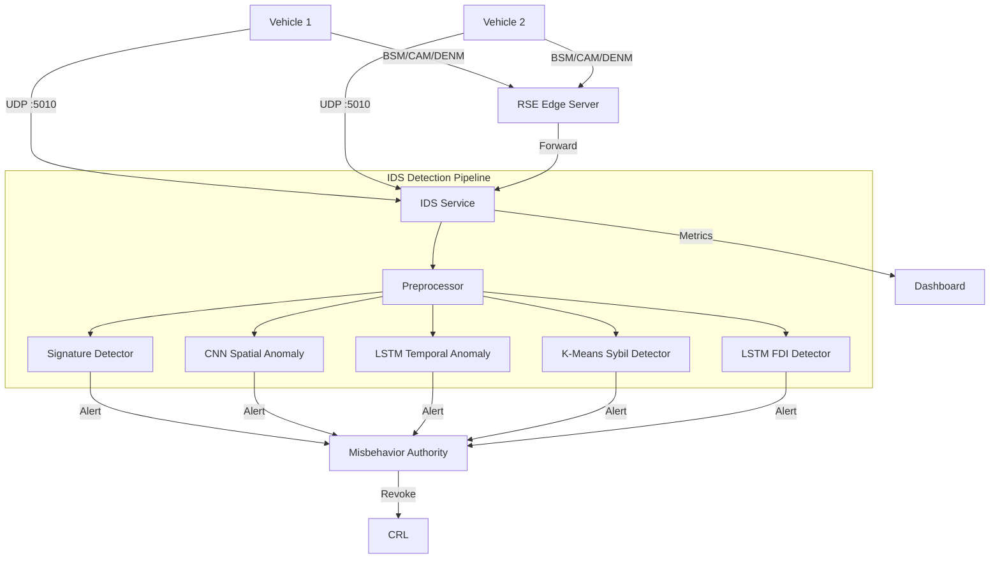

# Hybrid AI-Driven IDS — Implementation Plan

## Architecture Overview



## File Structure

```
ids/
├── __init__.py
├── config.py                      # Centralized configuration
├── ids_service.py                 # Main Flask service (port 5010)
├── Dockerfile                     # Separate Dockerfile with ML deps
├── requirements.txt               # IDS-specific requirements
├── preprocessing/
│   ├── __init__.py
│   └── bsm_preprocessor.py       # Cleaning, normalization, feature extraction
├── detection/
│   ├── __init__.py
│   ├── signature_detector.py     # CRL-based signature verification
│   ├── anomaly_detector.py       # Hybrid CNN+LSTM orchestrator
│   ├── sybil_detector.py         # K-Means clustering for Sybil attacks
│   └── fdi_detector.py           # LSTM for False Data Injection
├── models/
│   ├── __init__.py
│   ├── cnn_model.py              # 1D-CNN for spatial patterns
│   ├── lstm_model.py             # LSTM for temporal patterns
│   └── trainer.py                # Model training pipeline
├── metrics/
│   ├── __init__.py
│   └── evaluator.py              # Precision, Recall, F1, ROC-AUC
└── data/
    ├── __init__.py
    └── generate_training_data.py  # Synthetic BSM data with labeled attacks
```

## Phases

| Phase | Description | Key Files |
|-------|-------------|-----------|
| 1 | Core IDS Infrastructure | `ids_service.py`, `config.py` |
| 2 | Preprocessing Pipeline | `bsm_preprocessor.py` |
| 3 | Detection Engines | `signature_detector.py`, `anomaly_detector.py`, `sybil_detector.py`, `fdi_detector.py` |
| 4 | AI Models (CNN + LSTM) | `cnn_model.py`, `lstm_model.py`, `trainer.py` |
| 5 | Metrics & Evaluation | `evaluator.py`, `generate_training_data.py` |
| 6 | System Integration | `docker-compose.yml`, `vehicle.py`, `misbehavior_authority.py`, `dashboard/app.py` |
| 7 | Testing | `test_ids.py` |

## Detection Targets

| Attack Type | Detection Method | Target Metric |
|-------------|-----------------|---------------|
| Sybil | PKI + K-Means Clustering | F1 ≥ 95.1% |
| False Data Injection | LSTM Trajectory Analysis | Detection Rate ≥ 96.8% |
| Replay | Timestamp + Signature Verification | Precision ≥ 98% |
| DoS Flooding | Rate Limiting + CNN Pattern | Latency < 10ms |
| Revoked Certificate | CRL + Signature Check | 100% Coverage |
